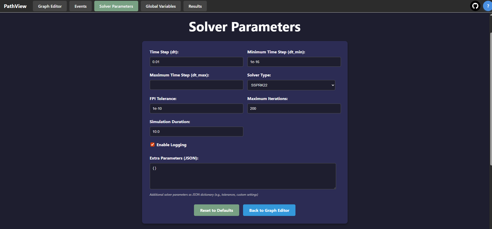

===============================
Usage and Examples
===============================

Getting Started
---------------

Here's a simple example to get you started with PathView:

#. **Start the Application**
   
   After installation, launch PathView:
   
   .. code-block:: bash
   
      npm run start:both
   
   Navigate to http://localhost:5173 in your browser.

#. **Load Example Files**
   
   PathView includes several pre-built example graphs in the `example_graphs/ <https://github.com/festim-dev/pathview/tree/main/example_graphs>`_ directory that demonstrate different functionality:
   
   * ``harmonic_oscillator.json`` - Simple oscillator simulation
   * ``pid.json`` - PID controller example
   * ``festim_two_walls.json`` - Two-wall diffusion model
   * ``linear_feedback.json`` - Linear feedback system
   * ``spectrum.json`` - Spectral analysis example
   
   To load an example:
   
   * Use the file import functionality in the application
   * Select any ``.json`` file from the `example_graphs/ <https://github.com/festim-dev/pathview/tree/main/example_graphs>`_ directory
   * The graph will load with pre-configured nodes and connections
   * Click the Run button to run the example

#. **Create Your Own Graphs**
   
   * Drag and drop nodes from the sidebar
   * Connect nodes by dragging from output handles to input handles
   * Configure node parameters in the properties panel
   * Use the simulation controls to run your model

Step by step guide
------------------

#. **Start the Application**
   
   After installation, launch PathView:
   
   .. code-block:: bash
   
      npm run start:both
   
   Navigate to http://localhost:5173 in your browser.
   
   .. figure:: images/step_by_step_guide/0.png
      :width: 600px
      :align: center
   
      PathView main interface after starting the application.

#. **Add nodes**

   In the left sidebar, drag and drop:

   * under Sources: Sinusoidal source
   * under Processing: Delay
   * under Output: Scope

   .. figure:: images/step_by_step_guide/1.png
      :width: 600px
      :align: center
      
      Dragging nodes from the sidebar to the canvas.

   .. figure:: images/step_by_step_guide/2.png
      :width: 600px
      :align: center
      
      PathView interface after adding the three nodes.

#. **Connect Nodes**

   * Connect the Sinusoidal source to the Delay
   * Connect the Sinusoidal source to the Scope
   * Connect the Delay to the Scope

   .. figure:: images/step_by_step_guide/3.png
      :width: 600px
      :align: center

      PathView interface after connecting the nodes.

#. **Run and visualise results**
    
   * Click the Run button
   * The graph will display the sinusoidal signal and its - slightly - delayed version

   .. figure:: images/step_by_step_guide/4.png
      :width: 600px
      :align: center

      If you zoom in you can see the delay, but it is very small.

#. **Configure Nodes**

   Let's change the parameters of the nodes to see how it affects the simulation

   * Select the Graph Editor tab
   * Select the Delay node and set the ``tau`` parameter to ``0.1``
   * Select the Sinusoidal source and set the ``frequency`` to ``0.7 Hz``
   * Click the Run button again to see the updated results

   .. figure:: images/step_by_step_guide/5.png
      :width: 600px
      :align: center

   .. figure:: images/step_by_step_guide/6.png
      :width: 600px
      :align: center

      After changing the parameters, the delay is now clearly visible.

#. **Save Your Graph**

   * Click the Save File button
   * Choose a location and filename for your graph
   * Click Save to export your graph as a JSON file

#. **Export graph to python script**

   * Click the Save to Python button
   * Choose a location and filename for your Python script
   * Click Save to export your graph as a Python script

Global variables
----------------

Global variables can be defined in the Global Variables tab. These variables can be used across multiple nodes in your graph, allowing for easier management of common parameters.

Let's take the [previous example](#step-by-step-guide).

#. Go to the Global Variables tab.

   .. figure:: images/global_vars/0.png
      :width: 600px
      :align: center

#. Click the "Add Variable" button to create a new global variable.
#. Name the variable ``a`` and set its value to ``0.1``.

   .. figure:: images/global_vars/1.png
      :width: 600px
      :align: center
    
      Note: you can remove a variable by clicking the red icon next to it.

#. Go back to the Graph Editor tab.
#. Select the Delay node.
#. In the node panel, set the ``amplitude`` parameter to ``12 * a`` and the ``frequency`` to ``7 * a``.

   .. figure:: images/global_vars/2.png
      :width: 200px
      :align: center
    

#. Select the Delay node.
#. Set the ``tau`` parameter to ``a + 0.05``.
#. Click the Run button to see the results.

   .. figure:: images/global_vars/3.png
      :width: 600px
      :align: center
    

Solver parameters
-----------------

The Solver Parameters tab allows you to configure the simulation parameters such as time step, maximum simulation time, and numerical solver settings.

Visualisation and post-processing
---------------------------------

In the Results tab, you can visualize the simulation results.
Each scope node will have its own plot in the Results tab.
You can toggle the visibility of each line by clicking on it in the legend.

- **Download CSV**: You can download the simulation results as a CSV file for further analysis.
- **Download HTML**: You can download the simulation results as an HTML file for easy sharing and viewing in a web browser.

Export to python
------------------

For advanced users, PathView allows you to export your graph as a Python script. This feature is useful for integrating your simulation into larger Python projects or for further analysis using Python libraries.

This is useful for instance for performing parametric studies or sensitivity analysis, where you can easily modify parameters in the Python script and rerun the simulation.

Sharing Graphs via URL
----------------------

PathView supports sharing complete graph configurations through URLs, making collaboration and graph distribution easy.

**How to share a graph:**

1. Create and configure your graph with all necessary nodes, connections, and parameters
2. Click the "🔗 Share URL" button in the floating action buttons (top-right area)
3. The complete graph URL is automatically copied to your clipboard
4. Share this URL with others - when they visit it, your exact graph configuration will load automatically

**What's included in shared URLs:**

- All node positions and configurations
- Edge connections and data flow
- Solver parameters and simulation settings
- Global variables and their values
- Event definitions
- Custom Python code

**Best practices:**

- URLs work best for moderately-sized graphs. For very complex graphs with many nodes, consider using the file save/load functionality instead
- URLs contain all graph data encoded in base64, so they can become quite long
- The shared graph state is completely self-contained - no server storage required

**Example use cases:**

- Sharing example configurations with students or colleagues
- Creating bookmarks for frequently-used graph templates
- Collaborating on model development
- Including interactive models in documentation or presentations
